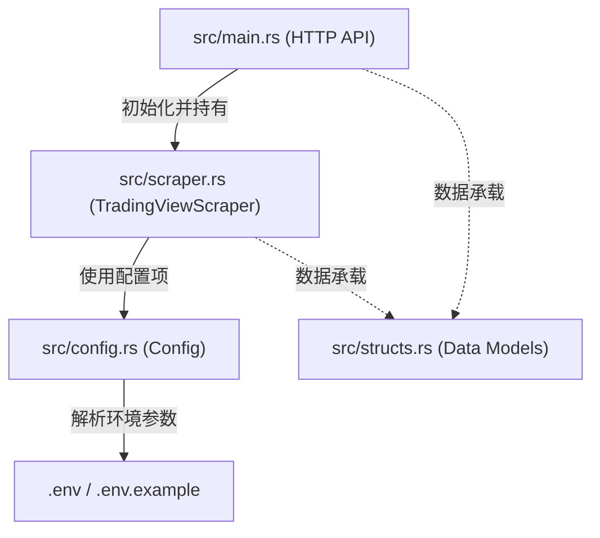

# TradeSnap

> **TradeSnap** 是一个轻量级、高并发的 TradingView 图表截图与数据抓取服务，使用 Rust 语言开发。

针对量化交易系统、监控报警系统以及社群机器人对 TradingView 技术分析图表的实时渲染与分享需求，TradeSnap 采用 Rust 语言与 `headless_chrome` 自动化库重构了传统的 Python 方案。本项目提供极其轻量且强健的无头浏览器实例池化与自愈管理，并以高性能的 Axum HTTP 接口向外暴露服务，支持直接生成图表分享直链或提取剪贴板 Base64 图片数据。

---

## 1. 核心功能

*   **双模式截图抓取**：
    *   **链接模式**：通过模拟点击 UI 并复制链接，捕获 `tradingview.com/x/...` 原始分享链接，并自动将其转换为 TradingView 官方 S3 存储的直链（如 `https://s3.tradingview.com/snapshots/...`）。每次捕获前会清空剪贴板，确保读取到的始终是本次请求生成的最新链接，避免返回上一次请求残留的旧快照。
    *   **图片数据模式**：通过键盘快捷键（`Ctrl+Shift+S`）向页面派发事件，直接从剪贴板捕获二进制 PNG 图片，并以 Base64 (`data:image/png;base64,...`) 数据 URL 形式返回。
*   **智能时间周期转换**：自动将人性化的时间周期输入（例如 `1h`、`4h`、`1D`、`15m`）转换为 TradingView 认可的标准参数（如 `60`、`240`、`D`）。
*   **安全自动登录**：支持注入 `sessionid` 与 `sessionid_sign` 会话 Cookies，自动以 TradingView 登录用户身份访问页面，支持加载包含个人指标的自定义图表布局。
*   **服务自愈与常驻**：将无头浏览器实例句柄常驻内存以实现秒级快速截图。并在遭遇网络抖动、页面崩溃或浏览器进程意外终止时，提供自愈重连与预检重构机制，保障服务 7×24h 稳定运行。
*   **Docker 环境兼容与锁清理**：在启动时自动清理 profile 目录下的 stale 锁定文件（`SingletonLock` 等），解决 Docker 挂载卷中常遇的 Chromium 重启锁冲突。

---

## 2. 架构与模块

本项目遵循模块化的 Rust 项目设计，目录结构如下：

```text
tradesnap/
├── src/
│   ├── lib.rs          # 统一 pub mod 导出各个功能模块
│   ├── main.rs         # 程序的入口点，基于 Axum 框架构建 HTTP API 服务
│   ├── scraper.rs      # 基于 headless_chrome 控制 Chromium 的核心截图模块
│   ├── config.rs       # 使用 dotenvy 载入并校验系统环境变量
│   └── structs.rs      # 存放跨模块共享的纯数据结构与 API 响应定义
├── examples/           # 使用示例
│   └── simple.rs       # 独立调试与测试浏览器操作逻辑的控制台示例
├── tests/              # 集成测试
│   └── config_test.rs  # 针对周期映射逻辑及 S3 转换正则的单元测试
├── Dockerfile          # 生产环境多阶段构建 Dockerfile
├── docker-compose.yml  # 本地容器编排配置（运行于 cycle 内部网）
├── .env                # 实际环境变量配置文件（已在 .gitignore 中忽略）
├── .env.example        # 环境变量模板文件（提交至版本库）
├── Cargo.toml          # 项目 Cargo 配置文件
└── CHANGELOG.md        # 变更日志
```

各模块间关系图：



---

## 3. 环境要求

*   **Rust 编译器**：Rust 1.85.0+ (MSRV，采用 Edition 2024)
*   **操作系统**：Linux (如 Ubuntu/Debian), macOS
*   **外部依赖**：
    *   **Chromium / Google Chrome**：运行环境内必须安装 Chrome/Chromium 浏览器。
        *   Linux 系统中如果存在 `/snap/bin/chromium`，本服务将自动识别并使用。
    *   **Docker / Docker Compose**（可选）：若需要以容器化方式部署本服务。

---

## 4. 安装与启动

### 4.1 本地编译运行

```bash
# 1. 克隆仓库并进入目录
git clone https://github.com/exchanges-lab/tradesnap.git
cd tradesnap

# 2. 复制环境变量配置文件并进行编辑
cp .env.example .env

# 3. 编译并运行服务 (默认监听端口 8003)
cargo build --release
cargo run --release
```

### 4.2 Docker 容器化部署

本项目适用于 Docker 容器部署，并支持与宿主机环境的网络隔离，推荐在内部网络（如 `cycle`）中通信：

```bash
# 1. 构建镜像并打上版本标签
docker build -t ghcr.io/exchanges-lab/tradesnap:v1.0 -t ghcr.io/exchanges-lab/tradesnap:latest .

# 2. 启动容器服务
docker compose up -d
```

---

## 5. 使用示例

我们提供了一个可以脱离 Axum HTTP 服务独立运行的测试脚本，以便验证浏览器控制逻辑与剪贴板读取授权是否正常工作：

```bash
# 运行独立的使用示例（需要先配置好本地 .env 文件）
cargo run --example simple
```

该示例代码位于 [examples/simple.rs](examples/simple.rs)，它会初始化无头浏览器实例、导入 Cookie、导航至测试图表页面，并自动触发一次 "Copy Link" 截图复制流程，将获取的 TradingView 快照 URL 打印在控制台上。

---

## 6. 环境变量说明

TradeSnap 支持通过系统环境变量或项目根目录下的 `.env` 文件进行配置：

| 环境变量名 | 用途说明 | 是否必填 | 默认值 | 示例值 |
| :--- | :--- | :--- | :--- | :--- |
| `RUST_LOG` | 结构化日志输出级别过滤（tracing 框架） | 否 | `info` | `debug`, `info`, `warn` |
| `TRADINGVIEW_SESSION_ID` | 您的 TradingView 账户 `sessionid` Cookie 值 | 是 | - | `your_session_id_here` |
| `TRADINGVIEW_SESSION_ID_SIGN` | 您的 TradingView 账户 `sessionid_sign` Cookie 值 | 是 | - | `your_session_id_sign_here` |
| `MCP_SCRAPER_HEADLESS` | 是否无头（后台）模式运行 Chromium 浏览器 | 否 | `true` | `true` 或 `false` |
| `MCP_SCRAPER_WINDOW_WIDTH` | 浏览器虚拟视口宽度（影响截图的分辨率） | 否 | `1920` | `1920` |
| `MCP_SCRAPER_WINDOW_HEIGHT` | 浏览器虚拟视口高度（影响截图的分辨率） | 否 | `1080` | `1080` |
| `MCP_SCRAPER_CHART_PAGE_ID` | 您的 TradingView 自定义图表保存布局 ID (在 S3 转换时使用) | 否 | - | `your_layout_id` |
| `MCP_SCRAPER_USE_SAVE_SHORTCUT` | 截图捕获模式：`true` 触发 Ctrl+Shift+S 返回 Base64 数据；`false` 触发 Click 复制返回 S3 官方链接 | 否 | `true` | `false` |
| `TRADESNAP_REQUEST_TIMEOUT_SECONDS` | 单次截图请求的硬超时；超时后终止卡住的 Chromium 并返回 HTTP 504 | 否 | `20` | `20` |

---

## 7. API 接口文档

服务启动后，可以通过 HTTP 接口发起截图请求：

### 7.1 获取图表快照 `GET /chart`

**请求 Query 参数：**

*   `ticker` (必填): TradingView 标的代码（如 `BYBIT:BTCUSDT.P`、`BINANCE:ETHUSDT` 等）
*   `interval` (必填): 图表时间周期（如 `1m`、`15m`、`1h`、`4h`、`1d` 等）

**测试请求示例：**

```bash
curl "http://localhost:8003/chart?ticker=BYBIT:BTCUSDT.P&interval=4h"
```

**响应 JSON 格式 (S3 链接模式 - `MCP_SCRAPER_USE_SAVE_SHORTCUT="false"`)：**

```json
{
  "ticker": "BYBIT:BTCUSDT.P",
  "interval": "4h",
  "image_url": "https://in.tradingview.com/x/abCdEfG/",
  "png_url": "https://s3.tradingview.com/snapshots/a/abCdEfG.png"
}
```

**响应 JSON 格式 (Base64 图片数据模式 - `MCP_SCRAPER_USE_SAVE_SHORTCUT="true"`)：**

```json
{
  "ticker": "BYBIT:BTCUSDT.P",
  "interval": "4h",
  "image_url": "data:image/png;base64,iVBORw0KGgo...",
  "png_url": "data:image/png;base64,iVBORw0KGgo..."
}
```

### 7.2 健康检查 `GET /`

**请求示例：**

```bash
curl "http://localhost:8003/"
```

**响应 JSON：**

```json
{
  "status": "ok"
}
```

---

## 8. 测试与开发

本项目提倡标准 Git 工作流，请在开发前和提交代码前遵守以下流程：

### 8.1 格式化与静态检查

在提交代码之前，请确保运行以下命令进行代码美化和静态代码检查：

```bash
# 格式化所有代码
cargo fmt

# 运行 Clippy 静态代码检查（禁止所有的 Warnings）
cargo clippy --all-targets --all-features -- -D warnings
```

### 8.2 运行测试

使用内置的 Cargo 命令执行所有的单元测试与集成测试：

```bash
cargo test
```

### 8.3 开发分支约定

*   **默认分支**：日常所有新功能开发和 Bug 修复工作必须在 `dev` 分支上完成。
*   **合并与发版**：确保测试、Clippy 静态检查与示例代码全部通过后，方可将 `dev` 分支合并至 `main` 主分支。

---

## 9. 变更日志指引

项目的每次功能迭代与缺陷修复详情，请参阅 [CHANGELOG.md](CHANGELOG.md)。
